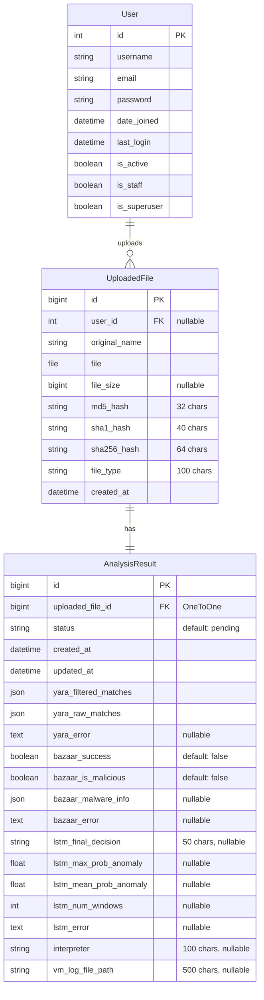

# Entity Relationship Diagram (ERD) - MalSandbox Database

## Mermaid ERD Diagram



## Text-Based ERD

```
┌─────────────────────────────────────────────────────────┐
│                        User                             │
│  (Django Built-in Model)                                │
├─────────────────────────────────────────────────────────┤
│  PK  id                  : BigAutoField                  │
│      username            : CharField                     │
│      email               : EmailField                   │
│      password            : CharField (hashed)           │
│      date_joined         : DateTimeField                 │
│      last_login          : DateTimeField                 │
│      is_active           : BooleanField                  │
│      is_staff            : BooleanField                  │
│      is_superuser        : BooleanField                  │
└─────────────────────────────────────────────────────────┘
                          │
                          │ 1
                          │
                          │ (CASCADE)
                          │
                          ▼
┌─────────────────────────────────────────────────────────┐
│                    UploadedFile                         │
├─────────────────────────────────────────────────────────┤
│  PK  id                  : BigAutoField                  │
│  FK  user_id             : ForeignKey(User)              │
│                         : null=True, blank=True          │
│      original_name       : CharField(255)                │
│      file                : FileField                     │
│      file_size           : BigIntegerField               │
│                         : null=True, blank=True          │
│      md5_hash            : CharField(32)                 │
│      sha1_hash           : CharField(40)                 │
│      sha256_hash         : CharField(64)                 │
│      file_type           : CharField(100)                │
│      created_at          : DateTimeField                 │
│                         : auto_now_add=True              │
└─────────────────────────────────────────────────────────┘
                          │
                          │ 1
                          │
                          │ (OneToOne)
                          │ (CASCADE)
                          │
                          ▼
┌─────────────────────────────────────────────────────────┐
│                  AnalysisResult                         │
├─────────────────────────────────────────────────────────┤
│  PK  id                  : BigAutoField                  │
│  FK  uploaded_file_id    : OneToOneField(UploadedFile)   │
│                         : related_name='analysis_result' │
│                                                          │
│  ┌─ Status & Timestamps ─────────────────────────────┐  │
│  │  status              : CharField(32)               │  │
│  │                     : default='pending'            │  │
│  │  created_at          : DateTimeField               │  │
│  │                     : auto_now_add=True            │  │
│  │  updated_at          : DateTimeField               │  │
│  │                     : auto_now=True                │  │
│  └───────────────────────────────────────────────────┘  │
│                                                          │
│  ┌─ YARA Results ────────────────────────────────────┐  │
│  │  yara_filtered_matches : JSONField                 │  │
│  │                     : default=list                 │  │
│  │  yara_raw_matches      : JSONField                 │  │
│  │                     : default=list                 │  │
│  │  yara_error            : TextField                 │  │
│  │                     : null=True, blank=True        │  │
│  └───────────────────────────────────────────────────┘  │
│                                                          │
│  ┌─ Bazaar Results ──────────────────────────────────┐  │
│  │  bazaar_success        : BooleanField              │  │
│  │                     : default=False                │  │
│  │  bazaar_is_malicious   : BooleanField              │  │
│  │                     : default=False                │  │
│  │  bazaar_malware_info   : JSONField                 │  │
│  │                     : default=dict, null=True      │  │
│  │  bazaar_error          : TextField                 │  │
│  │                     : null=True, blank=True        │  │
│  └───────────────────────────────────────────────────┘  │
│                                                          │
│  ┌─ LSTM Results ────────────────────────────────────┐  │
│  │  lstm_final_decision   : CharField(50)             │  │
│  │                     : null=True, blank=True        │  │
│  │  lstm_max_prob_anomaly : FloatField                │  │
│  │                     : null=True, blank=True        │  │
│  │  lstm_mean_prob_anomaly: FloatField                │  │
│  │                     : null=True, blank=True        │  │
│  │  lstm_num_windows      : IntegerField              │  │
│  │                     : null=True, blank=True        │  │
│  │  lstm_error            : TextField                 │  │
│  │                     : null=True, blank=True        │  │
│  └───────────────────────────────────────────────────┘  │
│                                                          │
│  ┌─ VM Analysis ─────────────────────────────────────┐  │
│  │  interpreter          : CharField(100)             │  │
│  │                     : null=True, blank=True         │  │
│  │  vm_log_file_path     : CharField(500)             │  │
│  │                     : null=True, blank=True         │  │
│  └───────────────────────────────────────────────────┘  │
└─────────────────────────────────────────────────────────┘
```

## Relationship Summary

1. **User → UploadedFile** (One-to-Many)
   - One User can upload many Files
   - ForeignKey relationship with CASCADE delete
   - Optional (nullable) - files can exist without a user

2. **UploadedFile → AnalysisResult** (One-to-One)
   - Each UploadedFile has exactly one AnalysisResult
   - OneToOneField relationship with CASCADE delete
   - Related name: `analysis_result`

## Database Information

- **Database Engine**: PostgreSQL
- **Database Name**: MalSanbox_db
- **Host**: localhost
- **Port**: 5432

## Notes

- All models use `BigAutoField` for primary keys (Django 5.2 default)
- `UploadedFile.user` is optional (nullable) to allow anonymous uploads
- `AnalysisResult` stores results from multiple analysis engines:
  - **YARA**: Pattern matching results
  - **Bazaar**: Malware intelligence lookup
  - **LSTM**: Machine learning anomaly detection
  - **VM**: Virtual machine sandbox execution logs
- Timestamps are automatically managed (`auto_now_add`, `auto_now`)
