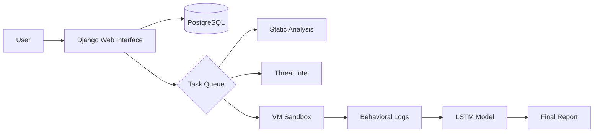

# 🛡️ PBL6 Malware Analysis Sandbox

**A comprehensive malware analysis platform combining static, dynamic, and ML-based detection.**

---

## 📋 Project Overview

This repository hosts a robust malware analysis system designed to detect zero-day threats and known signatures. It orchestrates a secure pipeline involving **YARA** pattern matching, **MalwareBazaar** intelligence, **LSTM** anomaly detection, and isolated **VM execution**.

### 🎯 Key Features
- **Multi-Engine Analysis**:
  - **Static**: YARA signature matching & PE header analysis.
  - **Intelligence**: Real-time hash lookups via MalwareBazaar.
  - **Dynamic**: VM-based execution monitoring (syscalls, file ops).
  - **ML-Based**: LSTM model for anomaly detection in behavioral logs.
- **Glassmorphism UI**: Modern, responsive web interface for file submissions and tracking.
- **Automated Orchestration**: Seamless handling of VM snapshots and file injection.
- **Detailed Reporting**: Comprehensive PDF reports and raw log access.

### 🏗️ System Architecture


---

## 🌟 Live Branches

The project is organized into feature branches for a modular development workflow:

### 🖥️ [`webserver`](../../tree/webserver) Branch
**Django Web Application & Core Backend**
- **Location**: `Server_v4/`
- **Core Logic**: Orchestrates the entire analysis pipeline.
- **Features**: User auth, file handling, VM control (`SandboxRunner.py`), and result aggregation.
- **ML Integration**: Includes the LSTM detection module and analysis utilities.

### 🔧 Other Components
- **`vm-agent`**: Analysis agent running inside the Guest VM.
- **`api`**: Standalone REST API (if separated from main webserver).

---

## 🚀 Quick Start

### 1. Clone the Repository
```bash
git clone https://github.com/XanakoneSPT/PBL6-SandBox.git
cd pbl6-sandbox
```

### 2. Switch to Web Application
```bash
git checkout webserver
cd Server_v4
# Follow the detailed README.md in this directory for setup
```

### 3. System Requirements
- **Host**: Windows/Linux
- **Python**: 3.8+ (with `virtualenv`)
- **Database**: PostgreSQL (Recommended) or SQLite
- **Virtualization**: VirtualBox (configured with Snapshot)
- **External Tools**: YARA, properly configured shared folders

---

## 📂 Branch & Feature

| Feature | Branch/Location | Status | Description |
|---------|-----------------|--------|-------------|
| **Main** | [`main`](../../tree/main) | ✅ Active | Repository entry point |
| **Web Interface** | [`webserver`](../../tree/webserver) | ✅ Active | Glassmorphism UI, Auth, Dashboard |
| **VM Orchestrator** | [`feature/vm-file-handler`](../../tree/feature/vm-file-handler) | ✅ Active | VM file upload & handling logic |
| **Pattern Detection** | [`feature/static-check`](../../tree/feature/static-check) | ✅ Active | Static analysis & code quality checks by YARA rules |
| **Malware Database** | [`feature/malwarebazaar-api`](../../tree/feature/malwarebazaar-api) | ✅ Active | MalwareBazaar API integration |
| **Behavioral Analysis** | [`feature/lstm-detection`](../../tree/feature/lstm-detection) | ✅ Active | ML model for behavioral analysis |
| **Report Gen** | [`feature/report-gen`](../../tree/feature/report-gen) | ✅ Active | PDF generation & log parsing |

---

## 🔄 Development Workflow

### For Contributors:
1.  **Clone**: `git clone <repo>`
2.  **Branch**: checkout `webserver` (main dev branch for backend).
3.  **Feature**: `git checkout -b feature/my-cool-feature`
4.  **PR**: Submit Pull Requests targeting **`webserver`**.

### For Users:
- **Deployment**: See [`Server_v4/README.md`](../../tree/webserver/README.md) for production deployment steps.

---

## 🛡️ Security Notice
⚠️ **DANGER: LIVE MALWARE HANDLING**
- This system executes real malware.
- **NEVER** run the Sandbox on a machine with sensitive data without strict isolation.
- Ensure the Host-Guest shared folders are strictly configured to prevent breakout.

---

## 🎓 Academic Project
- **Course:** PBL6 - Information Security Specialization Project
- **Focus:** Automated Malware Analysis & Sandboxing techniques.

---

## 👥 Authors
- **Xanakone Siphanthong**
- **Nguyen Viet Minh Duc**
